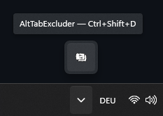
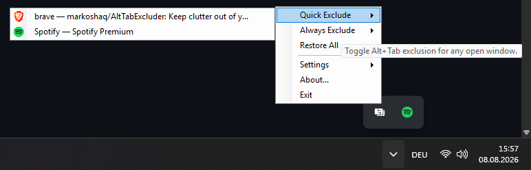
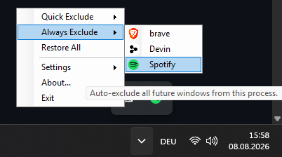
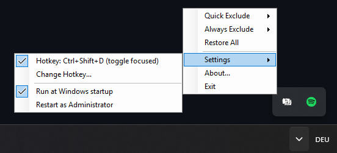
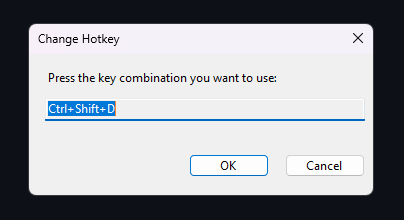
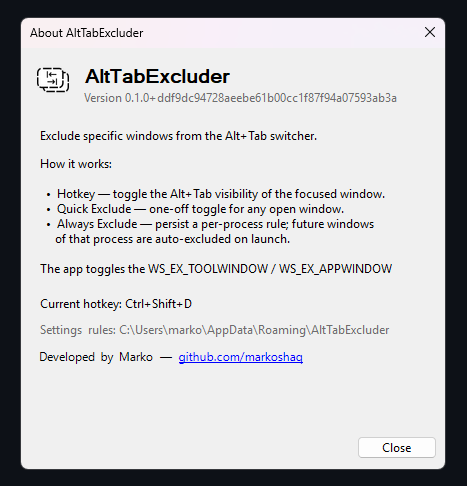

<div align="center">

# AltTabExcluder

**Keep clutter out of your Alt+Tab switcher.**

A lightweight Windows system-tray utility that lets you hide any window
from the Alt+Tab switcher — and optionally remember that choice so future
windows from the same app are excluded automatically.

[](https://github.com/markoshaq/AltTabExcluder/actions/workflows/ci.yml)
[](https://opensource.org/licenses/MIT)
[](https://dotnet.microsoft.com/download/dotnet/8.0)
[](tests/AltTabExcluder.Tests)
[](#development)

[Features](#features) &nbsp;&middot;&nbsp; [Screenshots](#screenshots) &nbsp;&middot;&nbsp; [Install](#install) &nbsp;&middot;&nbsp; [Usage](#usage) &nbsp;&middot;&nbsp; [Build](#build-from-source) &nbsp;&middot;&nbsp; [How It Works](#how-it-works)

</div>

---

AltTabExcluder runs quietly in your system tray. Press a hotkey to hide the
currently focused window from Alt+Tab, or open the tray menu to pick from a
list of all open windows. Want Spotify, Discord, or your email client to
*always* stay out of the switcher? Toggle **Always Exclude** once and every
future window from that app is hidden automatically. Settings (hotkey,
startup, restart-as-admin) are grouped under a **Settings** submenu.

It works by toggling the native Win32 `WS_EX_TOOLWINDOW` /
`WS_EX_APPWINDOW` extended window styles — no injection, no DLL hooking,
no background process eating memory. Just a tiny tray app that talks to the
window manager.

## Features

- **Hotkey toggle** — press `Win+Alt+X` (customizable) to instantly hide or
  restore the focused window from Alt+Tab. The hotkey's enabled/disabled
  state persists across restarts, and the tray icon tooltip shows the
  current hotkey on hover.
- **Quick Exclude** — browse all open windows from the tray menu and toggle
  each one with a click. Checkmarks show current state. Process icons are
  shown next to each window for easy identification.
- **Always Exclude** — save a per-process rule so every future window from
  that app is auto-excluded the moment it opens. No need to re-toggle each
  time you launch the app. Saved rules for apps that aren't currently
  running appear under a separator so you can manage them.
- **Restore All** — un-exclude every window AltTabExcluder has hidden, in one
  click. Useful when you've excluded a bunch of windows and want to reset
  quickly. A notification shows how many were restored.
- **Custom hotkey picker** — change the toggle shortcut to any combination
  (Win/Alt/Ctrl/Shift + any key) via a dedicated picker dialog. At least one
  modifier is required to prevent accidentally globally intercepting a bare
  key.
- **Single-instance** — a second launch exits silently instead of creating a
  duplicate tray icon or failing to register the hotkey.
- **Run at startup** — optional, per-user, no admin privileges required.
- **Elevation-aware** — detects when a target window is running as
  Administrator and offers a one-click "Restart as Administrator" so you can
  toggle elevated windows too.
- **About dialog** — app info, how-it-works summary, data location, current
  hotkey, and developer credit with a clickable GitHub link.
- **Tray-only** — no main window, no taskbar button, no clutter. Just an icon
  in the notification area.
- **Persistent** — your rules, hotkey setting, and enable/disable state
  survive restarts. All data files are written atomically (temp + move) so a
  crash can't corrupt them.
- **Diagnostic logging** — a rotating log file (`app.log`, 256 KB max with
  `.bak` backup) captures warnings and errors for troubleshooting. No more
  silent failures — every catch block logs with context.

## Screenshots

> **Add images here.** Capture the screenshots below, save them under
> `docs/screenshots/`, and the embeds below will render automatically.
> An animated GIF of the hotkey toggling a window out of Alt+Tab is the
> single most effective asset for reviewers who can't run the app.

| | |
|:---:|:---:|
|  |  |
| _Tray icon (tooltip shows the active hotkey)_ | _Quick Exclude — live window list with checkmarks & process icons_ |
|  |  |
| _Always Exclude — persistent per-process rules_ | _Settings — hotkey toggle, change hotkey, startup, restart-as-admin_ |
|  |  |
| _Hotkey picker — press any modifier+key combo_ | _About — app info, how-it-works, data location_ |


_Hotkey demo: focus a window, press `Win+Alt+X`, and it drops out of the
switcher instantly._

## Install

### Pre-built binary

Download the latest release from the [Releases](https://github.com/markoshaq/AltTabExcluder/releases)
page — a single self-contained `AltTabExcluder.exe` that requires no .NET
runtime installation. Just run it.

### Build from source

Requires the **.NET 8 SDK** and Windows 10/11 (x64).

```powershell
git clone https://github.com/markoshaq/AltTabExcluder.git
cd AltTabExcluder
dotnet build -c Release
```

The executable will be at
`src\AltTabExcluder\bin\x64\Release\net8.0-windows\AltTabExcluder.exe`.

Run it directly, or use the tray menu's **Run at Windows startup** option to
have it launch automatically on sign-in.

### Publish a single-file executable

```powershell
dotnet publish -c Release -p:PublishProfile=SingleFile
```

Produces a self-contained single-file exe at
`src\AltTabExcluder\bin\x64\Release\net8.0-windows\win-x64\publish\AltTabExcluder.exe`
that can be distributed without installing .NET on the target machine.

## Usage

### Hide the focused window

1. Focus the window you want to exclude.
2. Press `Win+Alt+X` (or your custom hotkey).
3. The window disappears from Alt+Tab. Press the hotkey again to restore it.

### Hide a specific window from the tray

1. Right-click the tray icon.
2. Go to **Quick Exclude**.
3. Click any window in the list to toggle its Alt+Tab visibility.
   - Windows with a checkmark are currently hidden.
   - Greyed-out items are natural tool windows (not excluded by
     AltTabExcluder) and can't be toggled.
   - The submenu stays open after a click so you can toggle multiple windows.

### Always exclude an app

1. Right-click the tray icon.
2. Go to **Always Exclude**.
3. Click a process name to create a persistent rule.
   - A checkmark means future windows from this app will be auto-excluded.
   - Click again to remove the rule.
4. Saved rules for apps that aren't currently running appear under a
   separator at the bottom — you can remove them there.

### Restore all excluded windows

1. Right-click the tray icon.
2. Click **Restore All**.
3. Every window that AltTabExcluder has hidden is restored to Alt+Tab at
   once. A notification shows how many windows were restored.

### Change the hotkey

1. Right-click the tray icon &rarr; **Settings** &rarr; **Change Hotkey...**
2. Press your desired key combination in the dialog. At least one modifier
   (Ctrl/Alt/Shift/Win) is required.
3. Click **OK**. If the combination is already in use by another app,
   you'll get a warning and the old hotkey is restored.

### Enable or disable the hotkey

1. Right-click the tray icon &rarr; **Settings**.
2. Click the **Hotkey** item to toggle it on or off.
3. The state is saved — if you disable the hotkey, it stays disabled on the
   next launch.

### Toggle elevated windows

If the focused window belongs to an Administrator-elevated process and
AltTabExcluder is running normally, the hotkey won't be able to change its
style (UIPI blocks it). You'll get a notification prompting you to
**Restart as Administrator** from the tray menu. After restarting, the
hotkey works on elevated windows too.

## How It Works

AltTabExcluder toggles two Win32 extended window styles on target windows:

| Style | Effect |
|-------|--------|
| `WS_EX_TOOLWINDOW` | Hides the window from Alt+Tab and the taskbar |
| `WS_EX_APPWINDOW` | Forces the window onto the taskbar/Alt+Tab |

To **exclude** a window: set `WS_EX_TOOLWINDOW`, clear `WS_EX_APPWINDOW`.
To **restore** it: clear `WS_EX_TOOLWINDOW`, set `WS_EX_APPWINDOW`.

After a style change, a `SetWindowPos(SWP_FRAMECHANGED)` call forces the
shell to re-evaluate the window's taskbar/Alt+Tab presence immediately.

The app uses [CsWin32](https://github.com/microsoft/CsWin32) for type-safe
Win32 P/Invoke bindings, generated from `NativeMethods.txt`.

### Auto-apply mechanism

For **Always Exclude** rules, the app installs a `SetWinEventHook` for
`EVENT_OBJECT_CREATE` and `EVENT_OBJECT_SHOW` (out-of-context, skipping its
own process). When a new top-level window appears that matches a saved rule,
the style is applied automatically — no DLL injection, callbacks arrive on
the UI thread via the message loop. Child windows are filtered out via
`GetAncestor(GA_ROOT)` so rules are only applied to top-level windows.

At startup, a one-time sweep applies existing rules to windows that were
already open before AltTabExcluder launched (the WinEvent hook only covers
windows created after it is installed).

### Storage

| File | Contents |
|------|----------|
| `%APPDATA%\AltTabExcluder\settings.json` | Hotkey configuration, hotkey enabled state, excluded-by-us HWND tracking |
| `%APPDATA%\AltTabExcluder\rules.json` | Persistent per-process exclusion rules |
| `%APPDATA%\AltTabExcluder\app.log` | Rotating log file (256 KB, with `.bak` backup) |

All files are written atomically (temp file + move) so a crash can't
corrupt them, and loaded fault-tolerantly (a corrupt file yields defaults
rather than crashing the app).

## Tech Stack

- **.NET 8** (`net8.0-windows`, x64)
- **WinForms** — tray icon, context menus, hotkey picker, about dialog
- **CsWin32** — source-generated Win32 P/Invoke bindings
- **xUnit + coverlet** — 102 unit tests with code coverage gates in CI
- **No WPF, no third-party dependencies** (beyond test tooling)

## Development

```powershell
dotnet build -c Debug
dotnet test
```

The test project (`tests/AltTabExcluder.Tests/`) covers the pure logic
layers: `WindowManager` style-bit math, `RuleEngine` persistence,
`AppSettings` formatting and round-trip, `ExclusionTracker`, `AppLogger`,
and `ProcessRule` record semantics. Win32/UI code is excluded from unit
tests (requires a live desktop session) but is covered by manual testing.

CI runs on every push/PR via GitHub Actions (`.github/workflows/ci.yml`):
Debug build, tests with coverage, Release build, single-file publish, and a
`dotnet format` style check.

**Coverage strategy.** Two gates are enforced in CI:

1. An **overall floor** (regression guard only — intentionally low, because
   Win32/UI/entry-point code can't be unit-tested without a live desktop
   session).
2. A **per-file gate of &ge;70%** on each testable logic layer
   (`AppSettings`, `RuleEngine`, `ExclusionTracker`, `ProcessRule`,
   `AppLogger`). This is the meaningful quality gate.

`WindowManager`'s pure style-bit math is fully tested, but its Win32 methods
drag the file's overall number down, so the file is excluded from the
per-file gate while its math is covered by `WindowManagerStyleMathTests`.

See [`docs/ARCHITECTURE.md`](docs/ARCHITECTURE.md) for the full architecture
documentation, and [`CONTRIBUTING.md`](CONTRIBUTING.md) for development
conventions. [`CHANGELOG.md`](CHANGELOG.md) tracks releases.

## Limitations

- **Elevated windows** require AltTabExcluder to also run elevated (UIPI).
  The app detects this and offers a restart-as-admin action.
- **Child windows** are not listed in Quick Exclude — only top-level
  windows with a title. The auto-apply watcher also filters out child
  windows via `GetAncestor(GA_ROOT)`.
- **HWND recycling**: the excluded-by-us tracking set persists HWND values,
  which the OS can recycle after a window closes. Stale entries are pruned
  when the tray menu opens; the per-process rule system is the more robust
  mechanism for persistent exclusion.

## License

MIT
