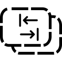

<div align="center">



# AltTabExcluder

**Keep clutter out of your Alt+Tab switcher.**

A lightweight Windows system-tray utility that lets you hide any window
from the Alt+Tab switcher — and optionally remember that choice so future
windows from the same app are excluded automatically.

[](https://github.com/markoshaq/AltTabExcluder/actions/workflows/ci.yml)
[](https://opensource.org/licenses/MIT)
[](https://dotnet.microsoft.com/download/dotnet/8.0)
[](docs/TESTING.md)

</div>

---

AltTabExcluder runs quietly in your system tray. Press a hotkey to hide the
currently focused window from Alt+Tab, or open the tray menu to pick from a
list of all open windows. It works by toggling the native Win32
`WS_EX_TOOLWINDOW` / `WS_EX_APPWINDOW` extended window styles — no injection,
no DLL hooking, no background process eating memory.

## Quick start

**Download** the latest release from the [Releases](https://github.com/markoshaq/AltTabExcluder/releases)
page — a single self-contained `AltTabExcluder.exe`. Just run it.

Press `Win+Alt+X` to hide the focused window from Alt+Tab. Press it again to
restore it. Right-click the tray icon for more options.

**Build from source** (requires .NET 8 SDK, Windows 10/11 x64):

```powershell
git clone https://github.com/markoshaq/AltTabExcluder.git
cd AltTabExcluder
dotnet build -c Release
```

## Features

- **Hotkey toggle** — `Win+Alt+X` (customizable) to hide/restore the focused window
- **Quick Exclude** — browse open windows from the tray, toggle each with a click
- **Always Exclude** — persistent per-process rules, auto-applied to future windows
- **Restore All** — un-exclude every hidden window in one click
- **Custom hotkey picker** — any Win/Alt/Ctrl/Shift + key combo
- **Run at startup** — optional, per-user, no admin needed
- **Elevation-aware** — detects elevated windows, offers restart-as-admin
- **Tray-only** — no main window, no taskbar button, no clutter
- **Persistent** — rules and settings survive restarts (atomic writes)

## Screenshots

| | |
|:---:|:---:|
|  |  |
|  |  |
|  |  |


## Documentation

- [Usage guide](docs/USAGE.md) — hide windows, always exclude, restore, hotkey settings
- [How it works](docs/HOW_IT_WORKS.md) — Win32 styles, auto-apply, HWND recycling, storage
- [Architecture](docs/ARCHITECTURE.md) — full design and Win32 interop notes
- [Testing & coverage](docs/TESTING.md) — unit tests, integration tests, coverage gates
- [Changelog](CHANGELOG.md) — release history
- [Contributing](CONTRIBUTING.md) — development conventions

## Limitations

- **Taskbar visibility** — excluding from Alt+Tab also removes from the taskbar
  (inherent to `WS_EX_TOOLWINDOW`; no Win32 way to hide from Alt+Tab alone).
- **Elevated windows** require AltTabExcluder to also run elevated (UIPI).
- **Child windows** are not listed — only top-level windows with a title.
- **HWND recycling** — mitigated via PID tracking; the per-process rule system
  is the more robust mechanism for persistent exclusion.

## License

MIT
